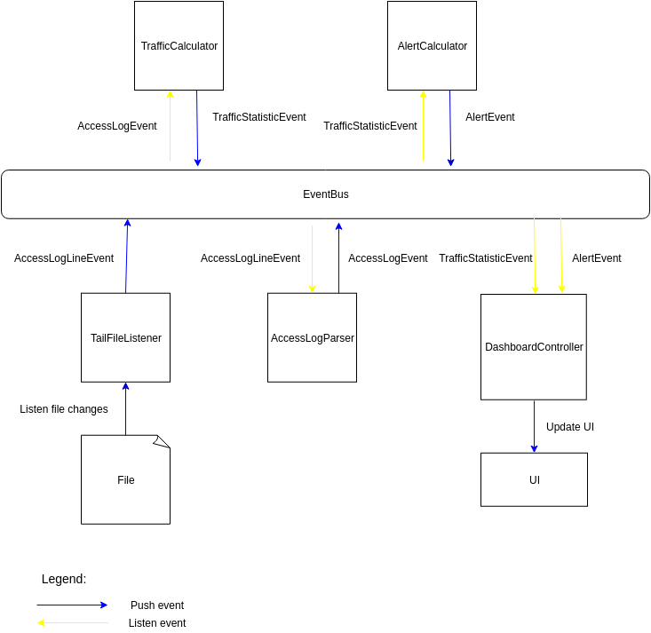

**Http log monitoring**

###### Description of modules
Project contains two modules
1. monitor - http log monitoring application
2. traffic-simulator - application for appending logs in common log format into file

###### How to build a project
Requirements:
1. Maven 3.6
2. Java 11

Use command to build a project:

`mvn clean package`

If you don't want to build a project you can find the _httpMonitor.jar_ and _simulator.jar_ in the root of the project

###### How to run monitor

To run monitor use command: 

`java -jar monitor/target/httpMonitor.jar`

Use `java -jar monitor/target/httpMonitor.jar -h` to find overridable parameters
 
###### How to run traffic-simulator
To run traffic-simulator use command:

`java -jar traffic-simulator/target/simulator.jar`

Use `java -jar traffic-simulator/target/simulator.jar -h` to find overridable parameters

##### Architecture of monitor

The central entity in the system in _EventBus_, which is used for asynchronous communication between different parts of the system.

##### Description of components

TailFileListener - listen changes from file and publish AccessLogLineEvent into event queue

AccessLogParser - Fetch parameters from common log line and publish AccessLogEvent

TrafficCalculator - Listen and accumulate AccessLogEvent. Based on `ticInterval` calculate traffic parameters and publish them into event bus

AlertCalculator - Listen and accumulate TrafficStatisticEvents. Based on `alertInterval`, trigger event for activating or hiding an event.

DashboardCalculator - Listen AccessLogEvent and TrafficStatisticEvents for updating UI

UI - Swing application

##### What can be improved
1. I would implement own query language for alerts that will give us the opportunity to define any alert. Also I would implement analyzers and executors that will process already defined alerts. This will give us the opportunity to support any alerts that can be created with our language without writing a new code.

2. I would rewrite the UI of application in more beautiful and informative way

3. Access log parse can be rewritten to sequential version which will work faster then current regex version.

4. This application is not scalable, because we store all the data in memory and our event bus use one thread to process data, it is not fault tolerance, there is no partitioning by topic event. We can use Redis cluster as cache to store most requested data and we can store historical data on the disk.
We can replace current event-bus with Kafka. Also we can use microservice architecture to decouple the application into different services. For example alert service, real time service, historical data       
